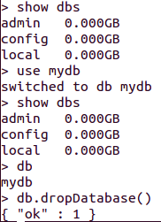
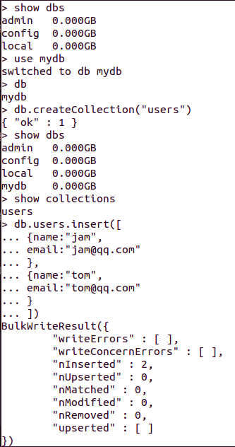
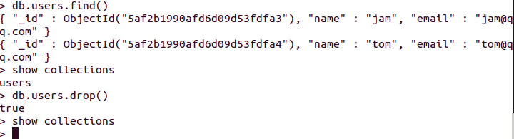
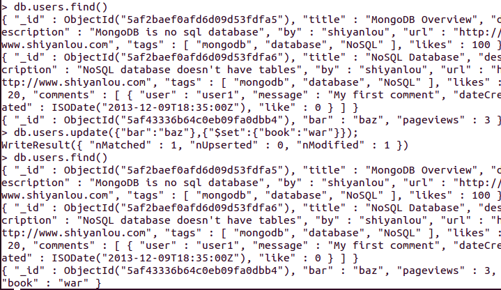

# MongoDB权威指南

# 1 简介

- MongoDB是一种强大、灵活、可扩展的数据存储方式。它扩展了关系型数据库的众多有用功能，如辅助索引、范围查询和排序 
- MongoDB功能丰富，如内置对MapReduce式聚合支持，以及对地理空间索引支持。

**丰富的数据类型**

- MongoDB是面向文档的数据库，不是关系型数据库。基本思路是将原来的"行"(row)的概念换成“文档”(document)模型。
- MongoDB没有模式：文档的键不会事先定义也不会固定不变。

**容易扩展**

- 面向文档的数据模型使其可以自动在多台服务器之间分割数据。
- 它还可以平衡集群的数据和负载，自动重排文档。

**丰富的功能**

- 索引
- 存储JavaScript
- 聚合：支持MapReduce和其他聚合工具。
- 固定集合：集合的大小有上限。
- 文件存储

**不牺牲速度**

- MongoDB使用MongoDB传输协议作为于服务器交互的主要方式。
- 它对文档进行动态填充，预分配数据文件，用空间换取性能稳定。

**简便的管理**

- MongoDB尽量让服务器自治来简化数据库的管理，
- 在分布式环境下，集群只要需要知道有新增加的节点，就会自动集成和配置新节点。

# 2 入门

**基本概念**

- **文档**(类似于关系型数据库中的行)是MongoDB中数据单元
- **集合**可以看做没有模型的表
- MongoDB的单个实例可以有多个独立的**数据库**
- MongoDB自带简洁但功能强大的JavaScriot shell
- 每一个文档都有一个特殊的键"_id"，它在文档所处的集合是唯一的。

## 2.1 文档

文档是MongoDB的核心概念，多个键及其关联的值有序的放在一起，便是文档。

文档的表示方法：映射、散列或字典。例如在JavaScript里面，文档表示为对象：

    {"greeting":"Hello, world!", "foo":3}

文档中键的顺序不重要。实际上，有些编程语言默认对文档的呈现根本就不顾忌顺序。 

文档的键是字符串。除了少数例外情况，键可以使用任意UTF-8字符。

- 键不能含有\0(空字符)。这个字符表示键的结尾。
- .和$有特殊的意义，只有在特定情况下使用(通常被保留了)。
- 以下划线"_"开头的键是保留的，虽然不是严格要求的。
- MongoDB不但区分类型，也区分大小写。
- MongoDB的文档不能有重复的键。

## 2.2 集合

集合是一组文档，类似于关系型数据库中的表。

集合是无模式的，一个集合里面的文档可以是各式各样的。

集合的命名原则：

- 集合名不能是空字符串""。
- 集合名不能包含\0字符(空字符)，这个字符表示集合名的结尾。
- 集合名不能以"system."开头，这是为系统集合保留的前缀。system.users这个集合保存着数据库的用户信息，system.namespaces集合保存着所有数据库集合的信息。
- 用户创建的集合名不能含有保留字符$。
- 子集合：组织集合的一种惯例是使用"."字符分开的按命名空间划分的子集合。

## 2.3 数据库

MongoDB中多个文档组成集合，多个集合组成数据库。一个MongoDB实例可以承载多个数据库。每一个数据库都有独立的权限控制。

数据库命名原则：

- 不能是空字符串("")
- 不得含有''(空格)、.、$、/、\和\0(空字符)。因为，数据库名最终会变为文件系统里的文件。
- 应全部小写。
- 最多64字节。

特殊作用的数据库：

- admin：这是"root"数据库
- local：这个数据不会被复制，用来存储限于本地单台服务器的任意集合。
- config：用于保留分片的相关信息。

把数据库的名字放在集合名前面，得到的就是集合的完全限定名。

## 2.4 基本操作

### 基本操作

启动 MongoDB 服务 :

    sudo service mongodb start

进入 MongoDB 命令行操作界面 :

    mongo

查看所有的数据库：

    > show dbs

使用use命令创建数据库：

    > use mydb

查看当前连接的数据库：

    > db

删除当前连接的数据库：

    db.dropDatabase()

### 集合操作

创建集合：

    > use mydb
    switched to db mydb
    > db.createCollection("users")

查看创建的集合：

    > show collections

向集合插入数据：

    > use mydb
    switched to db mydb
    > db.users.insert([
    ... { name : "jam",
    ... email : "jam@qq.com"
    ... },
    ... { name : "tom",
    ... email : "tom@qq.com"
    ... }
    ... ])

查看数据：

    > db.users.find()

删除集合：

    show collections
    db.users.drop()
    show collections

## 2.5 MongoDB Shell

mongo是个JavaScript shell，通过在线查看JavaScript的文档可以获得很多帮助。可以通过help命令查看。

使用 db.集合名 的方式访问集合一般不会有问题，但是集合名恰好是数据库类型的一个属性就会有问题、例如，要访问version这个集合，使用 db.version 就返回正在运行的MongoDB服务器的版本。可以使用getCollection函数：

    db.getCollection("version")

在JavaScript中，x.y 与 x['y']完全等价。

## 2.6 数据集合

- 基本数据类型：null、布尔、数字、字符串、数组和对象。
- 日期：{"x": new Date()}
- 数组：既可以作为有序对象(列表，栈或队列)，也可以作为无序对象(集合)来操作。
- 内嵌文档：就是把整个MongoDB文档作为另一个文档中键的一个值。
- _id和Objectid : MongoDB中存储的文档必须有一个"_id"键，这个键的值可以是任何类型的，默认为Objectid对象。Objectid是"_id"的默认类型，它使用12字节的存储空间，每个字节两位十六进制的数字，是一个24位的字符串。

# 3 创建、更新及删除文档

## 3.1 插入并保存文档

使用 insert 方法，插入一个文档：

    db.users.insert({"bar":"baz"})

如果插入多个文档，使用批量插入会快一些。批量插入会传递一个由文档构成的数据给数据库。

注意：大于4MB(转换为BSON)的文档是不能存入数据库中的。

## 3.2 删除文档

删除users集合中的所有文档，但是不会删除集合本身：

    db.users.remove()

remove函数可以接受一个查询文档作为可选参数，给定此参数后，只有符合条件的文档才会被删除。

    db.user.remove({"bar":"baz"})

下面的命令会删除集合本身：

    db.users.drop()

## 3.3 更新文档

文档存入数据库以后，可以使用update方法来修改它。update有两个参数，一个查询文档，用来更新文档，另一个是修改器(modifier)文档，描述对找到的文档做哪些修改。

    > var temp = db.users.findOne({"bar":"baz"});
    > temp.cpp = "hello world!";
    > db.users.update({"bar":"baz"},temp)

    > delete temp.cpp
    > db.users.update({"bar":"baz"},temp)

对变量temp操作，必须使用update后，数据库才会更新，不同于insert，会立即生效。另外，最好确保更新总是指定唯一文档，例如像"_id"这样的键来匹配。

### "$set"修改器入门

"$set"用来指定一个键的值，如果这个键不存在，则创建它。这对更新模式，或者增加用户定义键来说非常方便。

    db.users.update({"bar":"baz"},{"$set":{"book":"war"}});

可以使用"$unset"将键完全删除

    db.users.update({"bar":"baz"},{"$unset":{"book":1}});

也可以使用"$set"修改内嵌文档

### 增加或减少

“$inc”修改器用来增加已有键值，或者键不存在时创建一个键。

    db.users.update({"bar":"baz"},{"$inc":{"pageviews":1}});

注意："$inc"键的值必须为数字，不能使用字符串、数组、或其他非数字的值。

### 数组修改器

数组是常用且非常有用的数据结构，他们不仅是可以通过索引进行引用的列表，而且还可以作为集合来用。

"$push"会向已有的数组末尾加入一个元素，要是没有就会创建一个新的数组。

    > db.users.update({"bar":"baz"},{"$push":{"comments":{"name":"joe","content":"good jod"}}});
    WriteResult({ "nMatched" : 1, "nUpserted" : 0, "nModified" : 1 })
    > db.users.find()
    { "_id" : ObjectId("5af2baef0afd6d09d53fdfa5"), "title" : "MongoDB Overview", "description" : "MongoDB is no sql database", "by" : "shiyanlou", "url" : "http://www.shiyanlou.com", "tags" : [ "mongodb", "database", "NoSQL" ], "likes" : 100 }
    { "_id" : ObjectId("5af2baef0afd6d09d53fdfa6"), "title" : "NoSQL Database", "description" : "NoSQL database doesn't have tables", "by" : "shiyanlou", "url" : "http://www.shiyanlou.com", "tags" : [ "mongodb", "database", "NoSQL" ], "likes" : 20, "comments" : [ { "user" : "user1", "message" : "My first comment", "dateCreated" : ISODate("2013-12-09T18:35:00Z"), "like" : 0 } ] }
    { "_id" : ObjectId("5af43336b64c0eb09fa0dbb4"), "bar" : "baz", "pageviews" : 3, "comments" : [ { "name" : "joe", "content" : "good jod" } ] }

"$ne"如果一个值不在数组里面就把它加进去。

从下面的结果，可以看出，只匹配出一个文档，并更新此一个文档。

    > db.users.update({"bar":{"$ne":"666"}},{"$push":{"comments":{"name":"hgjfh","content":"go go go"}}});
    WriteResult({ "nMatched" : 1, "nUpserted" : 0, "nModified" : 1 })
    > db.users.find().pretty()
    {
        "_id" : ObjectId("5af2baef0afd6d09d53fdfa5"),
        "title" : "MongoDB Overview",
        "description" : "MongoDB is no sql database",
        "by" : "shiyanlou",
        "url" : "http://www.shiyanlou.com",
        "tags" : [
            "mongodb",
            "database",
            "NoSQL"
        ],
        "likes" : 100,
        "comments" : [
            {
                "name" : "joe",
                "content" : "good jod"
            },
            {
                "name" : "hgjfh",
                "content" : "go go go"
            }
        ]
    }
    {
        "_id" : ObjectId("5af2baef0afd6d09d53fdfa6"),
        "title" : "NoSQL Database",
        "description" : "NoSQL database doesn't have tables",
        "by" : "shiyanlou",
        "url" : "http://www.shiyanlou.com",
        "tags" : [
            "mongodb",
            "database",
            "NoSQL"
        ],
        "likes" : 20,
        "comments" : [
            {
                "user" : "user1",
                "message" : "My first comment",
                "dateCreated" : ISODate("2013-12-09T18:35:00Z"),
                "like" : 0
            }
        ]
    }
    {
        "_id" : ObjectId("5af43336b64c0eb09fa0dbb4"),
        "bar" : "baz",
        "pageviews" : 3,
        "comments" : [
            {
                "name" : "joe",
                "content" : "good jod"
            }
        ]
    }

"$addToSet"可以避免重复添加

"$eash"

"$pop"这个修改器可以从数组任何一段删除元素，{"$pop":{key:1}}从数组末尾删除一个元素，

"$pull"可以做到不依据位置，而基于特定条件来删除元素。"$pull"会将所有匹配的部分删除。

有两种方法操作数组中的值：通过位置或者定位操作符("$")。数组都是以0开头的，可以将下标直接作为键来选择元素。

定位操作符"$"，用来定位查询文档已经匹配的元素，并进行更新。定位符只更新第一个匹配的元素。

### upsert

upset是一种特殊的更新，要是没有文档符合更新条件，就会以这个条件和更新文档为基础创建一个新的文档。如果找到了匹配的文档，则正常更新。此操作是一个原子性的。

save是一个shell函数，可以在文档不存在时插入，存在时更新。

### 更新多个文档

默认情况下，更新只能对符合匹配条件的第一个文档执行操作，要是有多个文档符合条件，其余文档就没有变化。要使所有匹配道德文档都得到更新，可以设置update的第四个参数为true。

# A 安装MongoDB

MongoDB需要一个数据目录写入数据库文件，和一个端口用来监听连接。

“安装MongoDB”一般指的是构建核心的数据库服务器mongod。

版本选择：偶数版本号是稳定版(例如1.6开头)，奇数的是开发版(例如1.9开头)。

本次安装3.6.4版本，详细安装参见[Install MongoDB Community Edition on Ubuntu](https://docs.mongodb.com/manual/tutorial/install-mongodb-on-ubuntu/)

### Install MongoDB Community Edition

- Import the public key used by the package management system

    sudo apt-key adv --keyserver hkp://keyserver.ubuntu.com:80 --recv 2930ADAE8CAF5059EE73BB4B58712A2291FA4AD5

- Create a list file for MongoDB

    Ubuntu 14.04
    echo "deb [ arch=amd64 ] https://repo.mongodb.org/apt/ubuntu trusty/mongodb-org/3.6 multiverse" | sudo tee /etc/apt/sources.list.d/mongodb-org-3.6.list

    Ubuntu 16.04
    echo "deb [ arch=amd64,arm64 ] https://repo.mongodb.org/apt/ubuntu xenial/mongodb-org/3.6 multiverse" | sudo tee /etc/apt/sources.list.d/mongodb-org-3.6.list

- Reload local package database

    sudo apt-get update

- Install the MongoDB packages

    Install the latest stable version of MongoDB:
    sudo apt-get install -y mongodb-org

    Install a specific release of MongoDB:
    sudo apt-get install -y mongodb-org=3.6.4 mongodb-org-server=3.6.4 mongodb-org-shell=3.6.4 mongodb-org-mongos=3.6.4 mongodb-org-tools=3.6.4

- Pin a specific version of MongoDB

    echo "mongodb-org hold" | sudo dpkg --set-selections
    echo "mongodb-org-server hold" | sudo dpkg --set-selections
    echo "mongodb-org-shell hold" | sudo dpkg --set-selections
    echo "mongodb-org-mongos hold" | sudo dpkg --set-selections
    echo "mongodb-org-tools hold" | sudo dpkg --set-selections

### Run MongoDB Community Edition

- Start MongoDB

    sudo service mongod start

- Verify that MongoDB has started successfully

    /var/log/mongodb/mongod.log for a line reading：
    [initandlisten] waiting for connections on port 27017

- Stop MongoDB

    sudo service mongod stop

- Restart MongoDB

    sudo service mongod restart

- Begin using MongoDB

    mongo --host 127.0.0.1:27017
    Later, to stop MongoDB, press Control+C in the terminal

### Uninstall MongoDB Community Edition

- Stop MongoDB

    sudo service mongod stop

- Remove Packages

    sudo apt-get purge mongodb-org*

- Remove Data Directories

    sudo rm -r /var/log/mongodb
    sudo rm -r /var/lib/mongodb

