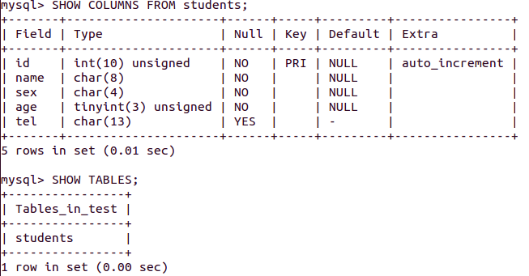
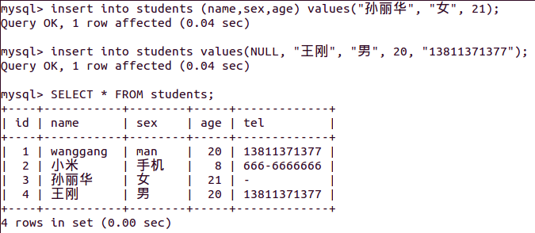
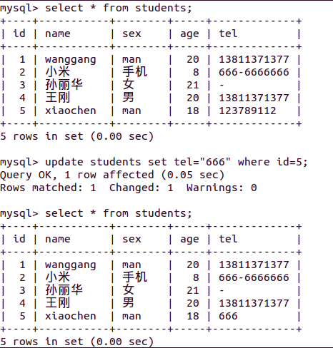
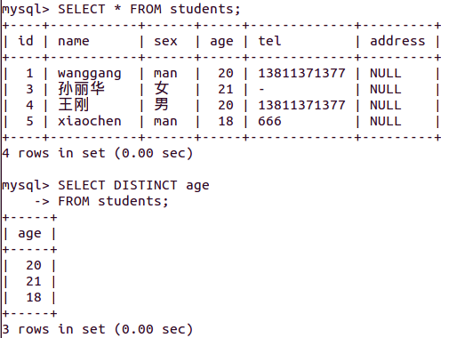
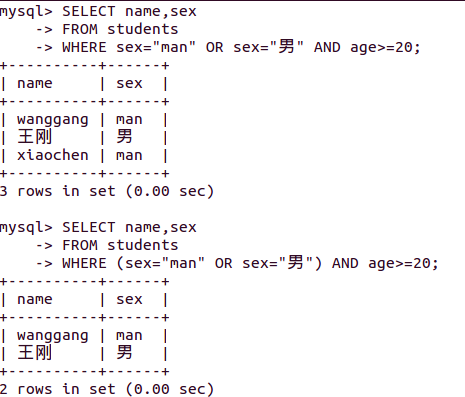
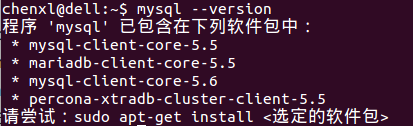
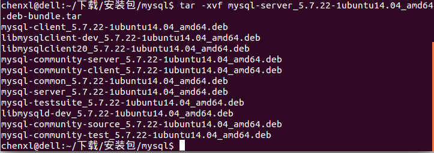
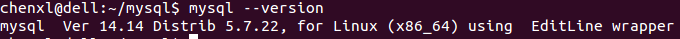
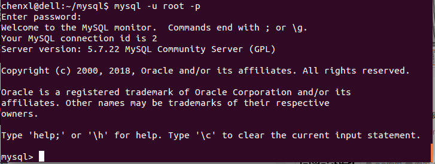

# MySQL必知必会

## 1 了解SQL

### 1.1 数据库基础

数据库基本概念：

- 数据库（database）： 保存有组织的数据的容器。
- 数据库软件应称为DBMS（数据库管理系统）。
- 数据库是通过DBMS创建和操纵的容器。

表：某种特定类型数据的结构化清单。

- 数据库中的每个表都有一个名字，用来标识自己。
- 模式（schema）：关于数据库和表的布局及特性的信息。

列和数据类型：

- 列（column）：表中的一个字段。所有表都是由一个或多个列组成的。
- 数据库中每个列都有相应的数据类型。
- 数据类型（datatype）：所容许的数据的类型。

行（row）：表中的一个记录。

主键（primary key）：一列（或一组列），其值能够唯一区分表中每个行。

- 应该总是定义主键 
- 键的最好习惯：不更新主键列中的值；不重用主键列的值；不在主键列中使用可能会更改的值。

小结：数据库中有表，表由行和列组成，建议表总是包含有主键。

### 1.2 什么是SQL

SQL结构化查询语言（Structured Query Language）

- SQL是一种专门用来与数据库通信的语言。
- 几乎所有重要的DBMS都支持SQL。

## 2 MySQL简介

### 2.1 什么是MySQL

MySQL是一种DBMS，即它是一种数据库软件。数据的所有存储、检索、管理和处理实际上是由数据库软件——DBMS（ 数据库管理系统完成的。 

DBMS可分为两类：

- 基于共享文件系统的DBMS：Microsoft Access和FileMaker
- 基于客户机—服务器的DBMS：MySQL、 Oracle以及Microsoft SQL Server等

客户机—服务器应用：

- 服务器部分是负责所有数据访问和处理的一个软件。
- 与数据文件打交道的只有服务器软件。
- 关于数据、数据添加、删除和数据更新的所有请求都由服务器软件完成。
- 客户机是与用户打交道的软件。
- 服务器软件为MySQL DBMS。你可以在本地安装的副本上运行，也可以连接到运行在你具有访问权的远程服务器上的一个副本。
- 客户机可以是MySQL提供的工具、脚本语言（如Perl）、 Web应用开发语言（如ASP、 ColdFusion、 JSP和PHP）、程序设计语言（如C、 C++、 Java）等。

### 2.2 MySQL工具

- mysql命令行实用程序：mysql
- MySQL Administrator（MySQL管理器）：一个图形交互客户机，用来简化MySQL服务器的管理。
- MySQL Query Browser：一个图形交互客户机，用来编写和执行MySQL命令

## 3 使用MySQL

### 3.1 连接

连接到MySQL，需要以下信息：

- 主机名（计算机名）——如果连接到本地MySQL服务器， 为localhost；
- 端口（如果使用默认端口3306之外的端口）；
- 一个合法的用户名；
- 用户口令（如果需要）。

### 3.2 创建一个数据库

- 使用CREATE DATABASE关键字：CREATE DATABASE test;

### 3.3 了解数据库和表

- SHOW命令来显示数据库：SHOW DATABASES；
- SHOW命令来显示当前选择的数据库内的表和列表：SHOW TABLES；
- SHOW也可以用来显示表列：SHOW COLUMNS FROM test; 或者使用DESCRIBE语句：DESCRIBE test;
- SHOW STATUS，用于显示广泛的服务器状态信息；
- SHOW CREATE DATABASE，用来显示创建特定数据库；
- SHOW CREATE TABLE，用来显示创建特定表的MySQL语句；
- SHOW GRANTS，用来显示授予用户（所有用户或特定用户）的安全权限；
- SHOW ERRORS和SHOW WARNINGS， 用来显示服务器错误或警告消息。

什么是自动增量？答：在每个行添加到表中时， MySQL可以自动地为每个行分配下一个可用编号，不用在添加一行时手动分配唯一值。

### 3.4 选择数据库

- 使用USE关键字：输入：USE test;

### 3.5 删除数据库

- 使用DROP DATABASE 关键字：DROP DATABASE test;

## 实践1：创建数据库和表

参考教程：[21 分钟 MySQL 入门教程](http://www.cnblogs.com/mr-wid/archive/2013/05/09/3068229.html#c1)

### 登录到MySQL 

mysql -h 主机名 -u 用户名 -p  

- -h : 该命令用于指定客户端所要登录的MySQL主机名, 登录当前机器该参数可以省略;
- -u : 所要登录的用户名;
- -p : 告诉服务器将会使用一个密码来登录, 如果所要登录的用户名密码为空, 可以忽略此选项。

### 创建一个数据库

create database 数据库名 [其他选项]; 

创建一个test数据库

create database test character set gbk; 

通过character set gbk; 将数据库字符编码指定为gbk，便于显示中文。

### 选择一个数据库

- 在登录数据库时指定：mysql -D 所选择的数据库名 -h 主机名 -u 用户名 -p 
- 登录后使用 use 语句指定：use 数据库名; 

### 创建数据库表

语句：create table 表名称(列声明); 

    create table students
    （
        id int unsigned not null auto_increment primary key,
        name char(8) not null,
        sex char(4) not null,
        age tinyint unsigned not null,
        tel char(13) null default "-"
    );

对于一些较长的语句在命令提示符下可能容易输错, 因此我们可以通过任何文本编辑器将语句输入好后保存为 createtable.sql 的文件中, 通过命令提示符下的文件重定向执行执行该脚本。

终端键入：mysql -D test -u root -p < createtable.sql 

(提示: 1.如果连接远程主机请加上 -h 指令; 2. createtable.sql 文件若不在当前工作目录下需指定文件的完整路径。) 

**语句解说：**

create table tablename(columns) 为创建数据库表的命令, 列的名称以及该列的数据类型将在括号内完成;

括号内声明了5列内容, id、name、sex、age、tel为每列的名称, 后面跟的是数据类型描述, 列与列的描述之间用逗号(,)隔开;

以 "id int unsigned not null auto_increment primary key" 行进行介绍:

- "id" 为列的名称;
- "int" 指定该列的类型为 int(取值范围为 -8388608到8388607), 在后面我们又用 "unsigned" 加以修饰, 表示该类型为无符号型, 此时该列的取值范围为 0到16777215;
- "not null" 说明该列的值不能为空, 必须要填, 如果不指定该属性, 默认可为空;
- "auto_increment" 需在整数列中使用, 其作用是在插入数据时若该列为 NULL, MySQL将自动产生一个比现存值更大的唯一标识符值。在每张表中仅能有一个这样的值且所在列必须为索引列。
- "primary key" 表示该列是表的主键, 本列的值必须唯一, MySQL将自动索引该列。

更多数据类型可参阅[MySQL数据类型](http://www.cnblogs.com/zbseoag/archive/2013/03/19/2970004.html)

### 操作mysql数据库

- 向表中插入数据(insert语句)

insert [into] 表名 [(列名1, 列名2, 列名3, ...)] values (值1, 值2, 值3, ...); 

其中 [] 内的内容是可选的, 例如, 要给 test 数据库中的 students 表插入一条记录, 执行语句:

insert into students values(NULL, "王刚", "男", 20, "13811371377"); 

insert into students (name, sex, age) values("孙丽华", "女", 21); 

但是，由于字段的数据类型设置的不合理，无法插入中文字符，因此首先修改显示中文字符的字段的数据类型。有两种常用的方式。

① 在创建表格时指定。比如：

    create table students (
        name varchar(100) character set utf8 collate utf8_unicode_ci,
        sex varchar(100) character set utf8 collate utf8_unicode_ci
    );

在加入  character set utf8 collate utf8_unicode_ci  属性后，表格的编码就成了utf8格式，这样就可以插入中文了。

② 直接更改字段的编码设置：

通过alter table 表格名 change 字段名 字段名 varchar(100) character set utf8 collate utf8_unicode_ci； 

例如：

通过alter table students change name name varchar(10) character set utf8 collate utf8_unicode_ci; 

通过alter table students change sex sex varchar(10) character set utf8 collate utf8_unicode_ci; 

此时，再通过 insert 语句，就可以正确的插入中文字符。

此时，数据库test的students表格如下图所示：

- 查询表中的数据

select 列名称 from 表名称 [查询条件]; 

或者使用通配符 * 查询表中所有内容，语句: select * from students;

- 按特定条件查询

where 关键词用于指定查询条件, 用法形式为: select 列名称 from 表名称 where 条件; 

例如，查询所有性别为女的信息，select * from students where sex="女"; 

where 子句不仅仅支持 "where 列名 = 值" 这种名等于值的查询形式, 对一般的比较运算的运算符都是支持的, 例如 =、>、<、>=、<、!= 以及一些扩展运算符 is [not] null、in、like 等等。 还可以对查询条件使用 or 和 and 进行组合查询, 以后还会学到更加高级的条件查询方式, 这里不再多做介绍。

例如：

select * from students where age > 21; 

select * from students where name like "%王%"; 

select * from students where id<5 and age>20; 

- 更新表中数据(updata 语句)

update 表名称 set 列名称=新值 where 更新条件; 

例如：

update students set tel=default where id=5; 

update students set age=age+1; 

update students set name="张伟鹏", age=19 where tel="13288097888"; 

- 删除表中数据(delete语句)

delete from 表名称 where 删除条件; 

例如：

delete from students where id=2; 

delete from students where age<20; 

delete from students; 

### 创建后表的修改

alter table 语句用于创建后对表的修改, 基础用法如下:  

- 添加列

alter table 表名 add 列名 列数据类型 [after 插入位置]; 

例如：

alter table students add address char(60); 

alter table students add birthday date after age; 

- 修改列

alter table 表名 change 列名称 列新名称 新数据类型; 

例如：

alter table students change tel telphone char(13) default "-"; 

alter table students change name name char(16) not null; 

- 删除列

alter table 表名 drop 列名称; 

例如：

alter table students drop birthday; 

- 重命令表：

alter table 表名 rename 新表名; 

例如：

alter table students rename workmates; 

- 删除整张表：

drop table 表名; 

例如：

drop table workmates; 

- 删除整个数据库

drop database 数据库名; 

例如：

drop database test; 

## 4 检索数据

### 4.1 SELECT语句

为了使用SELECT检索表数据，必须至少给出两条信息——想选择什么，以及从什么地方选择。

### 4.2 检索单个列

    SELECT sex
    FROM students;

### 4.3 检索多个列

    SELECT name,sex
    FROM students;

### 4.4 检索所有列

    SELECT * FROM students;

### 4.5 检索不同的行

SELECT返回所有匹配的行。但是，如果你不想要每个值每次都出现，可以使用DISTINCT关键字。

    SELECT DISTINCT age
    FROM students;

注：不能部分使用DISTINCT DISTINCT关键字应用于所有列而不仅是前置它的列。

### 4.6 限制结果

SELECT语句返回所有匹配的行，它们可能是指定表中的每个行。为了返回第一行或前几行，可使用LIMIT子句。

    SELECT name
    FROM students
    LIMIT 2;

可以指定要检索的开始行和行数：

    SELECT name
    FROM students
    LIMIT 2,2;

注：MySQL 5支持LIMIT的另一种替代语法。 LIMIT 4 OFFSET 3意为从行3开始取4行，就像LIMIT 3, 4一样。

### 4.7 使用完全限定的表名

    SELECT students.name
    FROM test.students;

## 5 排序检索数据

使用SELECT语句的ORDER BY子句，根据需要排序检索出的数据。

### 5.1 排序数据

为了明确地排序用SELECT语句检索出的数据，可使用ORDER BY子句。ORDER BY子句取一个或多个列的名字，据此对输出进行排序。

    SELECT age
    FROM students
    ORDER BY age;

注：通过非选择列进行排序 通常， ORDER BY子句中使用的列将是为显示所选择的列。但是，实际上并不一定要这样，用非检索的列排序数据是完全合法的。

### 5.2 按多个列排序

    SELECT name,sex,age
    FROM students 
    ORDER BY age,name;

### 5.3 指定排序方向

    SELECT name,sex,age
    FROM students 
    ORDER BY age DESC,name;

DESC关键字只应用到直接位于其前面的列名。如果想在多个列上进行降序排序， 必须对每个列指定DESC关键字。

使用ORDER BY和LIMIT的组合，能够找出一个列中最高或最低的值。

    SELECT age
    FROM students
    ORDER BY age DESC
    LIMIT 1;

ORDER BY子句的位置 ： 在给出ORDER BY子句时，应该保证它位于FROM子句之后。如果使用LIMIT，它必须位于ORDER BY之后。使用子句的次序不对将产生错误消息。

## 6 过滤数据

使用SELECT语句的WHERE子句指定搜索条件。

### 6.1 使用WHERE子句

只检索所需数据需要指定搜索条件（ search criteria） ，搜索条件也称为过滤条件（ filter condition）。

在SELECT语句中，数据根据WHERE子句中指定的搜索条件进行过滤。

    SELECT name,age
    FROM students
    WHERE age=20;

WHERE子句的位置 ： 在同时使用ORDER BY和WHERE子句时，应该让ORDER BY位于WHERE之后， 否则将会产生错误

### 6.2 WHERE子句操作符

| 操作符 | 说 明 | 
| -------- | -----: |
| = | 等于 |
| <> | 不等于 |
| != | 不等于 |
| < | 小于 |
| <= | 小于等于 |
| > | 大于 |
| >= | 大于等于 |
| BETWEEN | 在指定的两个值之间 |

检查单个值：

    SELECT name,age
    FROM students
    WHERE age>=20;

不匹配检查：

    SELECT name,age
    FROM students
    WHERE age<>20;

范围值检查：

    SELECT name,age
    FROM students
    WHERE age BETWEEN 20 AND 21;

空值检查：

    SELECT name
    FROM students
    WHERE address IS NULL;

## 7 数据过滤

组合WHERE子句以建立功能更强的更高级的搜索条件。我们还将学习如何使用NOT和IN操作符。

### 7.1 组合WHERE子句

为了进行更强的过滤控制， MySQL允许给出多个WHERE子句。这些子句可以两种方式使用：以AND子句的方式或OR子句的方式使用。

AND操作符：

    SELECT name,sex
    FROM students
    WHERE sex="man" AND age>=20;

OR操作符：

    SELECT name,sex,age 
    FROM students 
    WHERE sex="man" OR sex="女";

计算次序：

SQL（像多数语言一样）在处理OR操作符前，优先处理AND操作符。使用圆括号明确地分组相应的操作符。

### 7.2 IN操作符

圆括号在WHERE子句中还有另外一种用法。 IN操作符用来指定条件范围，范围中的每个条件都可以进行匹配。 IN取合法值的由逗号分隔的清单，全都括在圆括号中。

    SELECT name,age
    FROM students
    WHERE age IN (18,21);

与下面的语句等价，注意不是在18,21的范围，而是只有18,21两个值。

    SELECT name,age 
    FROM students 
    WHERE age=18 OR age=21;

使用IN操作符的优点：

- 在使用长的合法选项清单时， IN操作符的语法更清楚且更直观。
- 在使用IN时，计算的次序更容易管理（因为使用的操作符更少）。
- IN操作符一般比OR操作符清单执行更快。
- IN的最大优点是可以包含其他SELECT语句，使得能够更动态地建
立WHERE子句。

### 7.3 NOT操作符

WHERE子句中的NOT操作符有且只有一个功能，那就是否定它之后所跟的任何条件。

    SELECT name,age 
    FROM students 
    WHERE age NOT IN (18,21);

## 8 用通配符进行过滤

使用通配符以及怎样使用LIKE操作符进行通配搜索，以便对数据进行复杂过滤。

###　8.1 LIKE操作符

- 通配符（wildcard）：用来匹配值的一部分的特殊字符。
- 搜索模式（search pattern）：由字面值、通配符或两者组合构
成的搜索条件。
- 通配符本身实际是SQL的WHERE子句中有特殊含义的字符， SQL支持几种通配符。
- 为在搜索子句中使用通配符，必须使用LIKE操作符。 LIKE指示MySQL，后跟的搜索模式利用通配符匹配而不是直接相等匹配进行比较。

谓词 操作符何时不是操作符？答案是在它作为谓词（ predicate）时。从技术上说， LIKE是谓词而不是操作符。 

百分号(%)通配符：%表示任何字符出现任意次数。

    SELECT name,tel
    FROM students
    WHERE tel LIKE "138%";

区分大小写:根据MySQL的配置方式，搜索可以是区分大小写的。

通配符可在搜索模式中任意位置使用，并且可以使用多个通配符。

    SELECT name,tel 
    FROM students 
    WHERE tel LIKE "%137%";

注意NULL:虽然似乎%通配符可以匹配任何东西，但有一个例外，即NULL。 

下划线（ _）通配符:下划线只匹配单个字符而不是多个字符。

    SELECT name,sex
    FROM students
    WHERE sex LIKE "_an";

## 使用通配符的技巧

MySQL的通配符很有用。但这种功能是有代价的：通配符搜索的处理一般要比前面讨论的其他搜索所花时间更长。

- 不要过度使用通配符。如果其他操作符能达到相同的目的，应该使用其他操作符。
- 在确实需要使用通配符时，除非绝对有必要，否则不要把它们用在搜索模式的开始处。把通配符置于搜索模式的开始处，搜索起来是最慢的。
- 仔细注意通配符的位置。如果放错地方，可能不会返回想要的数据。

## 9 用正则表达式进行搜索

在MySQL WHERE子句内使用正则表达式来更好地控制数据过滤。

### 9.1 正则表达式介绍

正则表达式是用来匹配文本的特殊的串（字符集合）。

- 如果你想从一个文本文件中提取电话号码，可以使用正则表达式。
- 如果你需要查找名字中间有数字的所有文件，可以使用一个正则表达式。
- 如果你想在一个文本块中找到所有重复的单词，可以使用一个正则表达式。
- 如果你想替换一个页面中的所有URL为这些URL的实际HTML链接， 也可以使用一个正则表达式（对于最后这个例子，或者是两个正则表达式）。

### 9.2 使用MySQL正则表达式

MySQL仅支持多数正则表达式实现的一个很小的子集。

①基本字符匹配：REGEXP后所跟的东西作为正则表达式处理。

    SELECT name,tel 
    FROM students 
    WHERE tel REGEXP "1377";

.是正则表达式语言中一个特殊的字符，它表示匹配任意一个字符。

    SELECT name,age 
    FROM students 
    WHERE age REGEXP ".1";

- LIKE匹配整个列。如果被匹配的文本在列值中出现， LIKE将不会找到它，相应的行也不被返回（除非使用通配符）。
- REGEXP在列值内进行匹配，如果被匹配的文本在列值中出现， REGEXP将会找到它，相应的行将被返回。
- 为区分大小写，可使用BINARY关键字，如WHERE sex REGEXP BINARY '.an'。

②进行OR匹配：为搜索两个串之一（或者为这个串，或者为另一个串），使用|。

    SELECT name,tel 
    FROM students 
    WHERE tel REGEXP "66|113";

③匹配几个字符之一：匹配特定的字符，通过指定一组用[和]括起来的字符来完成。

    SELECT name,age 
    FROM students 
    WHERE age REGEXP "2[01]";

事实上，正则表达式2[01]为2[0|1]的缩写，也可以使用后者。

字符集合也可以被否定，即，它们将匹配除指定字符外的任何东西。为否定一个字符集，在集合的开始处放置一个^即可。因此，尽管[123]匹配字符1、 2或3，但[^123]却匹配除这些字符外的任何东西。

④匹配范围

集合可用来定义要匹配的一个或多个字符。

例如，下面的集合将匹
配数字0到9：[0123456789]，为简化这种类型的集合，可使用-来定义一个范围：[0-9]等同于上述数字列表。

⑤匹配特殊字符

## 附录A

ubuntu14.04 下 MySQL5.7.22 的安装。

方式1：通过apt安装

方式2：通过官网的安装包进行安装

网址：https://dev.mysql.com/downloads/mysql/5.7.html#downloads

下载：https://dev.mysql.com/downloads/file/?id=476744

解压后，有11个文件

首先使用sudo apt-get update 更新软件源

sudo apt-get upgrade，

使用 sudo dpkg -i 命令安装, 安装顺序：

- sudo dpkg -i mysql-common_5.7.22-1ubuntu14.04_amd64.deb
- sudo dpkg -i libmysqlclient20_5.7.22-1ubuntu14.04_amd64.deb
- sudo dpkg -i libmysqlclient-dev_5.7.22-1ubuntu14.04_amd64.deb
- sudo dpkg -i libmysqld-dev_5.7.22-1ubuntu14.04_amd64.deb
- 安装一个依赖包libaio1，命令为sudo apt-get install libaio1
- sudo dpkg -i mysql-community-client_5.7.22-1ubuntu14.04_amd64.deb
- sudo dpkg -i mysql-client_5.7.22-1ubuntu14.04_amd64.deb
- sudo dpkg -i mysql-community-source_5.7.22-1ubuntu14.04_amd64.deb 
- 安装依赖包libmecab2，命令为sudo apt-get install libmecab2
- sudo dpkg -i mysql-community-server_5.7.22-1ubuntu14.04_amd64.deb

最终，查看版本

常见的命令

- 进入MySQL: mysql -u root -p
- 三种命令退出sql: exit; quit; \q;
- 显示表：SHOW DATABASES;
- 启动: sudo service mysql start
- 重启:sudo  service mysql restart 
- 关闭: sudo service mysql stop
- 查看sql是否正在运行：service mysql status

进入mysql之后的界面为：

